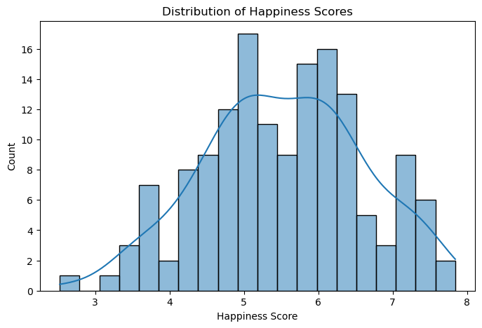
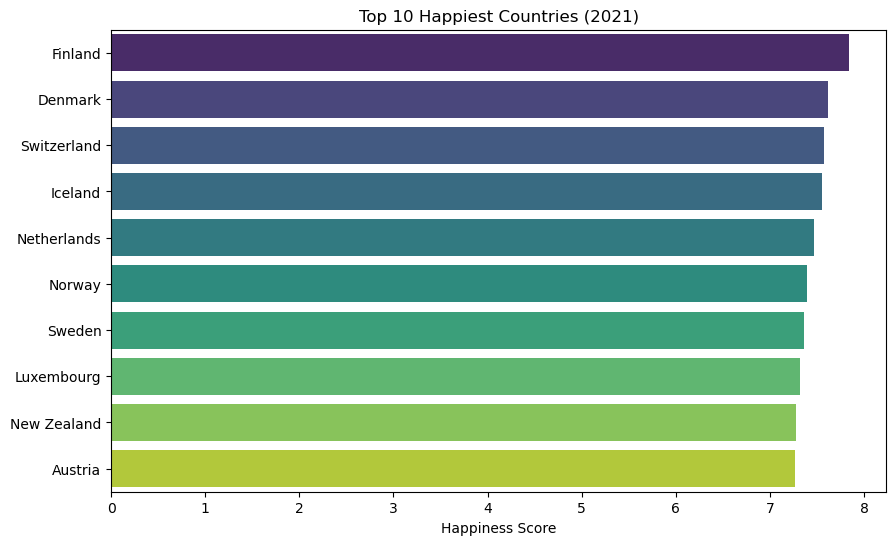
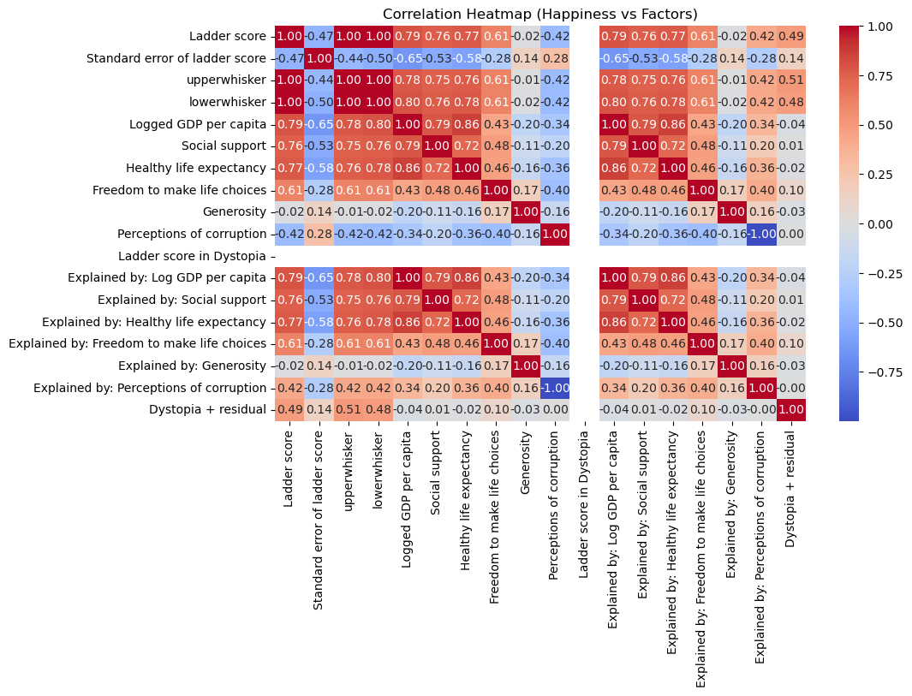
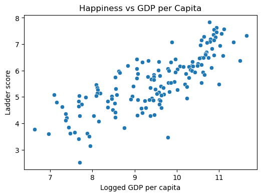
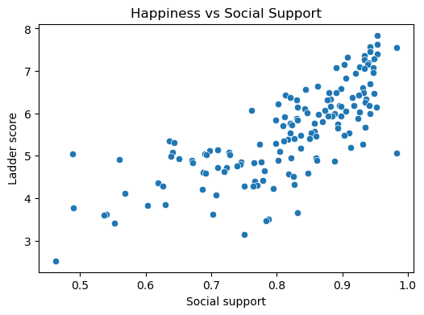

# 🌍 World Happiness Report --- Exploratory Data Analysis (EDA)

## 📌 Project Overview

This project explores the **World Happiness Report 2021**, a dataset
ranking countries by self-reported life satisfaction and related
factors.\
The goal is to perform **data cleaning, visualization, and correlation
analysis** to understand what drives happiness across nations.

------------------------------------------------------------------------

## 📊 Dataset

-   **Source:** [World Happiness Report
    2021](https://worldhappiness.report/archive/)\
-   **Rows:** \~150 countries\
-   **Columns (key features):**
    -   *Country name*\
    -   *Ladder score* (Happiness score, 0--10)\
    -   *Logged GDP per capita*\
    -   *Social support*\
    -   *Healthy life expectancy*\
    -   *Freedom to make life choices*\
    -   *Generosity*\
    -   *Perceptions of corruption*

------------------------------------------------------------------------

## 📓 Notebook

👉 All analysis code is in this Jupyter Notebook:\
[**World_Happiness.ipynb**](World_Happiness.ipynb)

GitHub will render the notebook directly in the browser, so you can view
the full workflow without downloading.

------------------------------------------------------------------------

## 🔎 Exploratory Analysis

### 1. Distribution of Happiness Scores

-   Most countries score between **5 and 7**.\
-   Very few countries score below 3 or above 8.

------------------------------------------------------------------------

### 2. Top 10 Happiest Countries (2021)

-   Highest scores: **Finland, Denmark, Switzerland, Iceland,
    Netherlands, Norway, Sweden, etc.**\
-   Consistently, **Nordic countries dominate the top rankings**.

------------------------------------------------------------------------

### 3. Correlation Insights

-   **Strong positive correlation** between happiness and:
    -   **GDP per capita**\
    -   **Social support**\
    -   **Healthy life expectancy**\
-   **Weaker correlation** with:
    -   Generosity\
    -   Perceptions of corruption

\
\

------------------------------------------------------------------------

## ✅ Key Takeaways

-   Economic prosperity and strong social support systems are **major
    drivers of happiness**.\
-   Health and freedom also play an important role.\
-   Wealth alone does not guarantee happiness --- cultural and
    governance factors matter.

------------------------------------------------------------------------

## ⚙️ Tools Used

-   **Python (Pandas, Matplotlib, Seaborn)** for EDA & visualization\
-   **Jupyter Notebook** for analysis\
-   **GitHub** for version control and documentation

------------------------------------------------------------------------

## 🚀 Next Steps

-   Compare results across multiple years (2019--2022).\
-   Build a simple regression model to **predict happiness scores**.\
-   Publish results in a blog post or dashboard.
